# 🚛 FreightFlow — B2B Logistics & Freight Management Platform

> A production-hardened full-stack logistics platform for shippers, drivers, and admins — built with **Node.js**, **Express**, **MongoDB**, and **Vanilla JS**.

[](https://github.com/aayush-1o/truck/actions/workflows/ci.yml)
[](https://github.com/aayush-1o/truck)
[](https://truck-production.up.railway.app)
[](https://github.com/aayush-1o/truck)
[](LICENSE)

---

## 📸 Overview

FreightFlow is a role-based freight management SaaS platform with three user types:

- **Shippers** — create shipments, track packages in real time, pay via Razorpay
- **Drivers** — receive assignments, update status on the go, manage earnings
- **Admins** — oversee all users and shipments, view analytics

---

## ✅ Status

| Phase | Status | Description |
|-------|--------|-------------|
| Phase 1 | ✅ Complete | Backend APIs, Authentication, Database Models |
| Phase 2 | ✅ Complete | Frontend-Backend Integration, Real Dashboards |
| Phase 3 | ✅ Complete | Payments (Razorpay), Real-time Tracking, Notifications |
| Phase 4 | ✅ Complete | Analytics Charts, Live Map, Rating System, Dark Mode, Email Alerts |
| Week 1 | ✅ Complete | Critical bug fixes and security hardening |
| Week 2 | ✅ Complete | Jest test suite (20 tests), ORS geocoding, JWT refresh token flow |
| Week 3 | ✅ Complete | Docker, GitHub Actions CI/CD, professional documentation |

🌐 **Live Demo:** https://truck-production.up.railway.app

---

## 🏗 Architecture

```mermaid
graph TD
    Client["Client — Vanilla JS<br/>api-client.js<br/>(auto-refresh interceptor)"]

    Client -->|"Bearer access token<br/>+ HttpOnly refresh cookie"| Routes

    subgraph Express["Express Server — server.js"]
        Routes["Routes<br/>/api/auth · /api/shipments<br/>/api/drivers · /api/payments"]
        Auth["middleware/auth.js<br/>protect() + authorize()"]
        Routes --> Auth
    end

    Auth -->|"JWT verify<br/>+ DB isActive check"| DB

    subgraph DB["MongoDB — Mongoose"]
        User["User model"]
        Driver["Driver model"]
        Shipment["Shipment model"]
        Payment["Payment model"]
        Notification["Notification model"]
    end

    Routes -->|"Driving distance"| ORS["OpenRouteService<br/>Geocoding API"]
    Routes -->|"Order + verify HMAC"| Razorpay["Razorpay<br/>Payments"]
    Routes -->|"Shipment events"| SocketIO["Socket.io<br/>Real-time rooms"]
    Routes -->|"Assignments + delivery alerts"| Email["Nodemailer<br/>Gmail SMTP"]
```



**Key design decisions:**
- **Separate `Driver` model** — vehicle attributes, availability, and earnings don't belong in `User`. Avoids null-heavy schema and makes role-based queries efficient.
- **Two-token auth** — 15-minute access tokens in memory, 7-day refresh tokens in `HttpOnly` cookies. XSS can't steal the refresh token; CSRF is blocked by `sameSite: strict`.
- **Geocoding fallback** — `utils/geocoding.js` always returns a number. If ORS is down or unconfigured, pricing uses a 100km default. Shipment creation never fails due to a third-party outage.

---

## 🧪 Testing

```bash
npm test                 # Run all 20 tests
npm run test:watch       # Watch mode for TDD
npm run test:coverage    # Coverage report in /coverage
```

| Suite | Tests | What's Covered |
|-------|-------|----------------|
| `auth.test.js` | 8 | Registration, login, role auth, user enumeration prevention |
| `shipments.test.js` | 6 | CRUD, role guards, shipper isolation, status updates |
| `payments.test.js` | 2 | Tampered vs valid HMAC-SHA256 Razorpay signature |
| `drivers.test.js` | 4 | Profile creation, availability toggle, GPS location, role guard |

Tests use `mongodb-memory-server` — no external MongoDB required to run them.

---

## 🐳 Docker

```bash
# Build the production image
docker build -t freightflow .

# Run with env file
docker run -p 5000:5000 --env-file .env freightflow

# Run full stack (app + MongoDB) locally
docker-compose up

# Rebuild after package.json changes
docker-compose up --build

# Stop and wipe volumes (clean slate)
docker-compose down -v
```

The Dockerfile uses a **multi-stage build**:
1. **Stage 1 (`deps`)** — installs only production dependencies with `npm ci --only=production`
2. **Stage 2 (`runner`)** — copies `node_modules` from Stage 1, removes `.env`/`seed.js` from image, runs as non-root user `freightflow` (uid 1001)

---

## 🚀 Quick Start

### Prerequisites
- Node.js v20+
- MongoDB (local or Atlas) **or** Docker

### 1. Clone the Repository
```bash
git clone https://github.com/aayush-1o/truck.git
cd truck
```

### 2. Install Dependencies
```bash
npm install
```

### 3. Configure Environment
```bash
cp .env.example .env
# Edit .env with your values (see Environment Variables table below)
```

### 4. Run the Development Server
```bash
npm run dev
```

Server starts at **http://localhost:5000**

### 5. Run with Docker (no MongoDB install needed)
```bash
docker-compose up
```

---

## 🌍 Environment Variables

| Variable | Required | Description | Example |
|----------|----------|-------------|---------|
| `MONGODB_URI` | ✅ | MongoDB connection string | `mongodb://localhost:27017/freightflow` |
| `JWT_SECRET` | ✅ | Access token signing secret (15min) | `your_long_random_string_here` |
| `JWT_REFRESH_SECRET` | ✅ | Refresh token signing secret (7 days) | `different_long_random_string` |
| `PORT` | ❌ | Server port (default: 5000) | `5000` |
| `CORS_ORIGIN` | ✅ prod | Allowed frontend origin(s), comma-separated | `https://truck-production.up.railway.app` |
| `ORS_API_KEY` | ❌ | OpenRouteService key for real driving distances | `eyJ...` |
| `RAZORPAY_KEY_ID` | ✅ | Razorpay public key | `rzp_test_...` |
| `RAZORPAY_KEY_SECRET` | ✅ | Razorpay secret key | `...` |
| `EMAIL_USER` | ❌ | Gmail address for shipment notifications | `you@gmail.com` |
| `EMAIL_PASS` | ❌ | Gmail App Password (not account password) | `xxxx xxxx xxxx xxxx` |
| `NODE_ENV` | ❌ | Environment (`development`/`production`/`test`) | `production` |

> ⚠️ **Never commit `.env` to git.** It is in `.gitignore` and excluded from the Docker image via `.dockerignore`.

---

## 🏗 Tech Stack

| Layer | Technology |
|-------|------------|
| **Backend** | Node.js 20, Express.js 5 |
| **Database** | MongoDB 7 + Mongoose |
| **Auth** | JWT (access + refresh tokens), bcryptjs |
| **Frontend** | HTML5, Tailwind CSS, Vanilla JS |
| **Real-time** | Socket.io |
| **Maps** | Leaflet.js (OpenStreetMap) |
| **Geocoding** | OpenRouteService Directions API |
| **Charts** | Chart.js |
| **Payments** | Razorpay (HMAC-SHA256 verification) |
| **Email** | Nodemailer + Gmail SMTP |
| **Testing** | Jest + Supertest + mongodb-memory-server |
| **CI/CD** | GitHub Actions → Railway |
| **Containers** | Docker (multi-stage), Docker Compose |
| **Hosting** | Railway (auto-deploy on merge to main) |

---

## 🔒 Security

| Measure | Implementation |
|---------|----------------|
| **Password hashing** | `bcrypt` with 12 salt rounds |
| **Authentication** | JWT access tokens (15min) + HttpOnly `sameSite: strict` refresh cookies (7 days) |
| **Payment integrity** | HMAC-SHA256 Razorpay signature verification before marking any payment complete |
| **Rate limiting** | `express-rate-limit`: 5 req/15min on `/login` and `/register`, 3 req/hr on `/forgot-password` |
| **CORS** | Locked to `CORS_ORIGIN` env var — no wildcard in production |
| **Input validation** | `express-validator` middleware on all write routes |
| **XSS prevention** | All notification content uses `textContent` (never `innerHTML`) |
| **Secret management** | Fail-fast on startup if `JWT_SECRET` or `MONGODB_URI` missing |
| **Static serving** | `express.static('public/')` only — project root never served |

To report a security vulnerability: see [SECURITY.md](SECURITY.md)

---

## � API Endpoints

### Auth
| Method | Endpoint | Auth | Description |
|--------|----------|------|-------------|
| `POST` | `/api/register` | — | Create new account |
| `POST` | `/api/login` | — | Login, returns access token + sets refresh cookie |
| `POST` | `/api/refresh` | Cookie | Issue new access token using refresh cookie |
| `POST` | `/api/logout` | — | Clear refresh token cookie |
| `POST` | `/api/forgot-password` | — | Send reset link (always returns 200) |
| `POST` | `/api/reset-password` | — | Reset password with token |

### Shipments
| Method | Endpoint | Auth | Description |
|--------|----------|------|-------------|
| `POST` | `/api/shipments` | Shipper | Create shipment (real driving distance price) |
| `GET` | `/api/shipments` | Any | List shipments (scoped by role) |
| `GET` | `/api/shipments/:id` | Any | Get single shipment |
| `PATCH` | `/api/shipments/:id/status` | Driver/Admin | Update status |
| `POST` | `/api/shipments/:id/rate` | Shipper | Rate driver |
| `GET` | `/api/shipments/track/:trackingId` | Public | Public tracking |

### Drivers
| Method | Endpoint | Auth | Description |
|--------|----------|------|-------------|
| `POST` | `/api/drivers` | Driver | Create profile |
| `PATCH` | `/api/drivers/availability` | Driver | Toggle availability |
| `PUT` | `/api/drivers/location` | Driver | Update GPS coordinates |
| `GET` | `/api/drivers/stats` | Driver | Earnings and stats |

### Payments
| Method | Endpoint | Auth | Description |
|--------|----------|------|-------------|
| `POST` | `/api/payments/order` | Shipper | Create Razorpay order |
| `POST` | `/api/payments/verify` | Shipper | Verify HMAC signature |
| `GET` | `/api/payments/history` | Any | Payment history |

### System
| Method | Endpoint | Auth | Description |
|--------|----------|------|-------------|
| `GET` | `/api/health` | — | Health check (uptime, db status) |

---

## 🤝 Contributing

```bash
# 1. Fork and clone
git clone https://github.com/aayush-1o/truck.git

# 2. Create a feature branch
git checkout -b feat/your-feature-name

# 3. Make changes, then run tests
npm test

# 4. Commit and push
git push origin feat/your-feature-name

# 5. Open a Pull Request — CI runs automatically
```

PRs must pass all 20 tests before merge.

---

## � License

MIT © [Ayush](https://github.com/aayush-1o)
